<div align="center">

# ⚡ Local Context Compiler (`lcc`)

**The deterministic, local-first engine that slashes LLM context size and token costs by up to 70% before prompt dispatch — zero network calls, zero API keys, no LLM inside the core.**

[](LICENSE)
[](pyproject.toml)
[](package.json)
[](https://github.com/lucasmartins-ai/lcc)
[](https://github.com/lucasmartins-ai/lcc/actions)
[](SECURITY.md)

</div>

---

## 💡 Quick Value Proposition

Most LLM applications waste 40–70% of their context window on invisible bloat: audio transcription artifacts, speech disfluencies, device signatures, and repeated chunks. `lcc` compiles and strips safe noise locally before your prompt ever hits an API.

- **🧹 Audio & Whisper Hallucination Filter**: Automatically eliminates STT artifacts (`[Music]`, `[Applause]`, `[Silence]`, subtitle credits) and English & Portuguese fillers (`um`, `basically`, `you know`, `tipo assim`, `né?`) without altering real vocabulary or code.
- **🛡️ 100% Code-block & Table Safe**: Masks fenced code blocks (` ``` ` and `~~~`) and Markdown tables before whitespace normalization, protecting indentation, alignment, and internal syntax.
- **🚫 Zero Token Leak Routing**: Applies lossless safe cleaning even on `REMOTE_DIRECT` cloud model routes, stopping device signatures and duplicate paragraphs from leaking into remote billing.
- **⚡ Deterministic & Sub-Millisecond**: Pure local algorithms with zero external network calls, zero API keys required, and zero LLMs in the core compression path.

---

## 🎬 Live Demo: Before & After

### Raw Input (Messy Transcript + Code)

````text
WEBVTT

00:00:01.000 --> 00:00:04.500
[Music]
Speaker 1: Um, okay so, we basically need to optimize the database query latency, né?

00:00:04.600 --> 00:00:08.000
Speaker 1: You know, the index on the orders table is currently, uh, sort of missing:

```sql
SELECT * FROM orders WHERE customer_id = 42 AND status LIKE '%active%';
```

00:00:08.100 --> 00:00:10.500
[Applause]
Thank you for watching!
Please subscribe to the channel.
````

### Cleaned `lcc` Compiled Output

````xml
<!-- lcc-intake:readiness status="READY_TO_EXECUTE" score="90" -->

<system_instructions>
  <role>You are a frontier technical assistant. Use only the provided context unless explicitly allowed otherwise.</role>
  <task_type>intake-refinement</task_type>
  <constraints>
    <rule>Base the answer strictly on the provided context.</rule>
    <rule>Maintain codebase stability</rule>
  </constraints>
</system_instructions>

<context>
Speaker 1: We need to optimize the database query latency. The index on the orders table is currently missing:

```sql
SELECT * FROM orders WHERE customer_id = 42 AND status LIKE '%active%';
```
</context>

<user_query>
Speaker 1: We need to optimize the database query latency.
</user_query>
````

> **Result**: 98 tokens → 46 tokens (**-53.1% token reduction**). Audio tags, filler words, and video outros stripped cleanly; SQL indentation and string literals preserved 100% intact with deterministic readiness triage.
>
> 👉 **Try it yourself:**
> ```bash
> lcc intake "[Music] Speaker 1: Um, we need to basically optimize the query latency, né?"
> ```

---

## 📊 Proven Token Savings & Cache Alignment

| Context Type | Raw Input Tokens | LCC Compiled Tokens | Token Savings | Cache Hit Potential |
| :--- | :---: | :---: | :---: | :---: |
| **Messy Whisper Audio Transcript (EN/PT)** | ~98 tokens (demo) / ~4,800 tokens | **46 tokens / 1,350 tokens** | **-53.1% to -71.8%** | ⭐⭐⭐⭐⭐ (Structured XML) |
| **Multi-File Context Dump** | ~18,500 tokens | **5,400 tokens** | **-70.8%** | ⭐⭐⭐⭐⭐ (>90% KV reuse) |
| **Vague Refactoring Brief** | ~2,100 tokens | **620 tokens** | **-70.4%** | ⭐⭐⭐⭐ (Zero Ambiguity) |
| **Direct Cloud Escalation (`REMOTE_DIRECT`)** | ~3,400 tokens | **2,200 tokens** | **-35.3%** | ⭐⭐⭐⭐ (Lossless Boilerplate Drop) |

---

## 🏛️ The 3 Pillars

```mermaid
flowchart LR
  subgraph P1["1. Deterministic Core"]
    direction TB
    C1["Speech & Whisper filtering"]
    C2["Code-safe normalization"]
    C3["Exact paragraph deduplication"]
  end

  subgraph P2["2. Intelligent Intake"]
    direction TB
    I1["Readiness classification"]
    I2["Operational brief structuring"]
    I3["Clarifying questions triage"]
  end

  subgraph P3["3. Local Agents & Router"]
    direction TB
    A1["Gemma 4 e4b (0 remote tokens)"]
    A2["Qwen3.5-4B (ChatML / JSON)"]
    A3["Rule & model verifiers"]
    A4["Selective Fireworks escalation"]
  end

  RawInput["Raw Context / Audio / Prompt"] --> P2
  P2 --> P1
  P1 --> P3
  P3 --> FinalOutput["Final Answer + Token Accounting"]
```



1. **Deterministic Core** (`lcc.cleaning`, `lcc.token_budget`, `lcc.pipeline`): 100% reproducible context cleaning with zero LLM hallucinations.
2. **Intelligent Intake** (`lcc.intake`): Triage messy prompts and transcripts into structured briefs with clear readiness scores (`READY_TO_EXECUTE`, `NEEDS_INTAKE`, `BLOCKED`).
3. **Local Agents & Hybrid Router** (`lcc.agents`, `lcc.router`): Executes edge-quantized local LLMs (**Gemma 4 e4b** & **Qwen3.5-4B**) with zero remote tokens, with automated verification before cloud escalation.

---

## 📦 Single-Step Installation

### Python CLI & Library (Python 3.11+)

```bash
# Install standard package
pip install local-context-compiler

# Install with exact tokenizer support (tiktoken)
pip install "local-context-compiler[tiktoken]"

# Or install globally as a CLI tool with pipx
pipx install "local-context-compiler[tiktoken]"
```

### Node.js / TypeScript Package (Node 18+)

```bash
npm install local-context-compiler
# or
pnpm add local-context-compiler
# or
yarn add local-context-compiler
```

---

## 🖥️ CLI Quick Start

```bash
# 1. Triage messy voice notes or Whisper transcripts into structured prompts
lcc intake "[Music] Speaker 1: Um, we need to basically optimize the query latency, né?"

# 2. Compile and optimize a context file with Claude XML template
lcc optimize context.txt --question "Find performance bottlenecks" --template claude_xml

# 3. Read-only diagnostic inspection (zero file modifications)
lcc inspect large_context.txt --model claude-sonnet-5

# 4. Run local agent with zero remote tokens
lcc agent run --prompt "Summarize token budget" --model gemma-4-e4b

# 5. Hybrid local routing with automated verification
lcc route run --task examples/tasks/noisy_context.json
```

---

## 🚀 Programmatic API

### Python API

```python
from lcc import process_intake, LccCompressor
from lcc.cleaning import clean_speech_transcript, safe_clean_text

# 1. Clean speech transcript directly
clean_text = clean_speech_transcript("[Music] Um, we need to deploy, né?")
# -> "We need to deploy."

# 2. Unified Intake Triage & Context Compilation
result = process_intake(
    "Rewrite auth middleware. Sent from my iPhone",
    model="claude-sonnet-5",
    template="claude_xml"
)
print(result.parsed.readiness)       # ReadinessState.READY_TO_EXECUTE
print(result.formatted_prompt)

# 3. Direct Lossless Compression
compressor = LccCompressor(model="claude-sonnet-5")
res = compressor.compress("Raw context...")
print(f"Saved: {res.savings_percentage}% tokens")
```

### TypeScript / Node.js API

```typescript
import { LccIntake, LccCompressor, processIntake } from 'local-context-compiler';

// 1. Unified Prompt Intake Pipeline
const result = processIntake(
  "[Music] Um, maybe we need to update the database schema, né?",
  "claude-sonnet-5",
  "claude_xml"
);

console.log(`Status: ${result.parsed.readiness}`); // READY_TO_EXECUTE
console.log(result.formattedPrompt);

// 2. Direct Context Compression
const compressor = new LccCompressor({ model: 'gpt-5.6-terra' });
const compressed = compressor.compress("Raw context...");
console.log(`Tokens saved: ${compressed.savedTokens}`);
```

---

## 🎯 Positioning: Determinism First

LLM-based context compressors are non-deterministic, slow, and burn tokens just to compress tokens. `lcc` is built on a different philosophy: **mechanical efficiency first**. By handling speech cleaning, syntax-safe whitespace normalization, and exact deduplication through fast deterministic code, you save money, improve KV-cache alignment, and guarantee predictable model behavior.

---

## 🏛️ Architectural Boundaries & ADRs

`lcc` is engineered around strict architectural boundaries:

- **Deterministic Core & Model-Assistance Boundary**: `src/lcc/` is model-free, offline, and deterministic ([ADR 0010](docs/adr/0010-deterministic-first-preparation-model-assistance.md)).
- **Offline Network Guard**: `lcc` blocks runtime network requests by default via a tightly scoped guard ([ADR 0008](docs/adr/0008-tokenizer-network-boundary.md)).
- **Inspection Boundary**: `lcc inspect` is strictly diagnostic and transformative-free ([ADR 0009](docs/adr/0009-inspection-command-boundary.md)).
- **Semantic Retrieval Boundary**: Phase 2 boundary status scaffold ([ADR 0011](docs/adr/0011-phase-2-opt-in-semantic-retrieval-boundary.md)).

---

## 🗺️ Roadmap

- [x] **Phase 1 Quick Wins**: Safe code-block normalization, `REMOTE_DIRECT` router leak fix, Whisper + English/Portuguese disfluency filter.
- [x] **Unified Intake & Agents**: Gemma 4 e4b / Qwen3.5-4B support, Claude XML / Code Agent templates.
- [ ] **Phase 2 (Opt-in)**: Semantic retrieval boundaries and extended multilingual filler sets (Spanish, French).
- [ ] **Phase 3**: Dynamic token budget auto-allocator across multi-agent turns.

---

## 🤝 Contributing & License

Contributions are welcome! Please open an issue or pull request on GitHub.

Open-source software licensed under the [MIT License](LICENSE). Built and maintained by [LookADev](https://lookadev.com).
