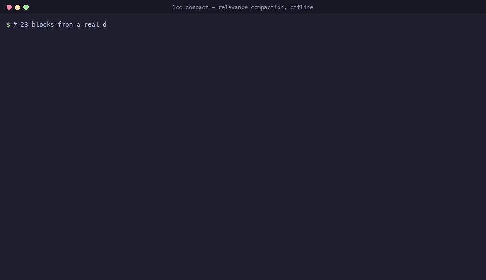
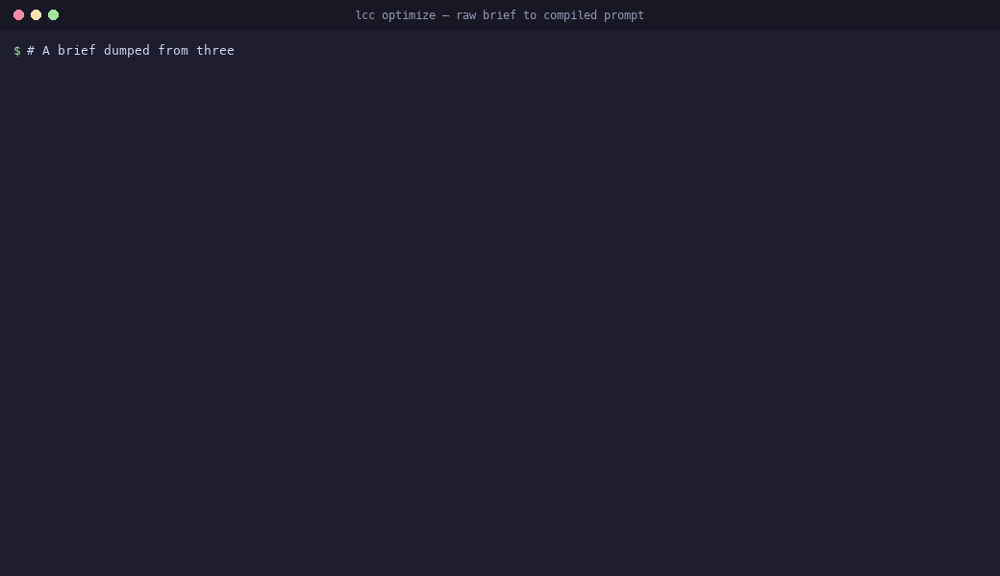
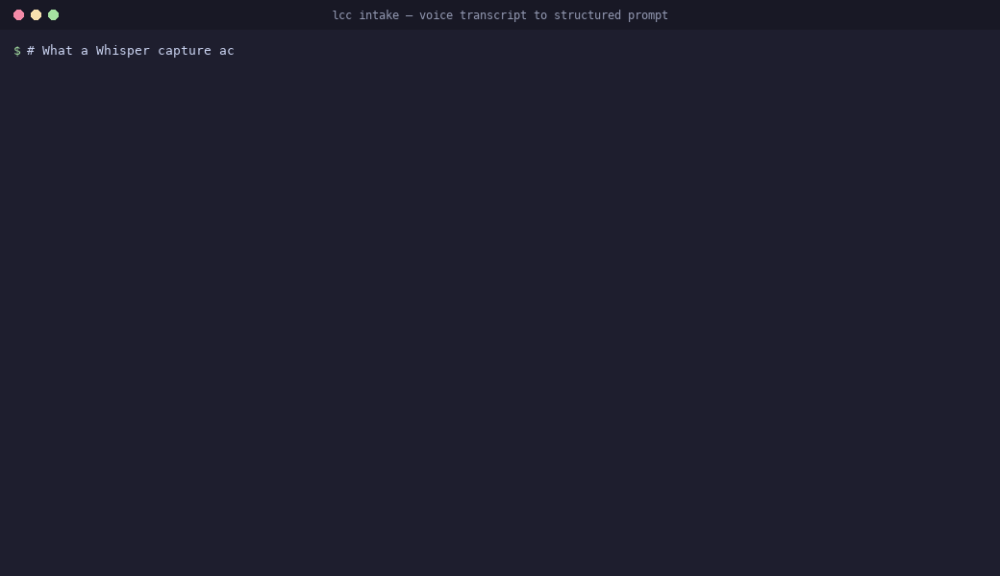

<div align="center">

# ⚡ Local Context Compiler (`lcc`)

**Jev-powered relevance compaction that never summarizes, and the local-first engine around it: deterministic context optimization, intake triage, exact token accounting, and local LLM agents (Gemma 4 e4b & Qwen3.5-4B).**

[](LICENSE)
[](pyproject.toml)
[](package.json)
[](https://github.com/lucasmartins-ai/lcc)
[](https://github.com/lucasmartins-ai/lcc/actions)
[](SECURITY.md)
[](docs/JEV.md)

</div>

---

## 📌 Table of Contents

- [The Jev path](#-the-jev-path-fastest-way-to-the-strongest-pass)
- [Overview & The 3 Pillars](#-overview--the-3-pillars)
- [Start here: QUICKSTART and MCP Server](#-start-here-quickstart-and-mcp-server)
- [See it work](#-see-it-work)
- [Does it work without a model API key?](#-does-it-work-without-a-model-api-key-yes-and-that-is-the-default-path)
- [Proven Token Savings & Cache Alignment](#-proven-token-savings--cache-alignment)
- [Single-Step Installation](#-single-step-installation)
- [The Unified Workflow](#-the-unified-workflow)
- [CLI Usage Guide](#-cli-usage-guide)
  - [`lcc intake` — Prompt Intake & Triage](#1-lcc-intake--prompt-intake--triage)
  - [`lcc optimize` — Direct Context Optimization](#2-lcc-optimize--direct-context-optimization)
  - [`lcc inspect` — Read-Only Diagnostic Inspection](#3-lcc-inspect--read-only-diagnostic-inspection)
  - [`lcc agent` — Local LLM Agents (Gemma 4 e4b & Qwen3.5-4B)](#4-lcc-agent--local-llm-agents-gemma-4-e4b--qwen35-4b)
  - [`lcc route` — Hybrid Local/Cloud Routing](#5-lcc-route--hybrid-localcloud-routing)
  - [`lcc compact` — Instant Relevance Compaction](#6-lcc-compact--instant-relevance-compaction-opt-in-cache-aware)
    - [Local Semantic Decision Backend: Laya](#local-semantic-decision-backend-laya-apache-20)
  - [`lcc explain` — Audit a compaction pass](#7-lcc-explain--audit-a-compaction-pass-after-the-fact)
  - [`lcc mcp` — MCP server for agents](#8-lcc-mcp--mcp-server-for-agents)
- [Programmatic Library API Usage](#-programmatic-library-api-usage)
  - [Python API](#python-api)
  - [TypeScript / Node.js API](#typescript--nodejs-api)
- [2026 Context Engineering Templates](#-2026-context-engineering-templates)
- [Architectural Boundaries & ADRs](#-architectural-boundaries--adrs)
- [Running Tests & Validation](#-running-tests--validation)
- [Built by LookADev](#built-by-lookadev)
- [License](#-license)

---

## ⚡ The Jev path (fastest way to the strongest pass)

`lcc compact --provider jev` sends your objective and your context blocks to TypeSafe's
System One as typed questions, gets keep-probabilities back, and drops only what the judge
concludes is no longer needed. Nothing is summarized: kept blocks are re-emitted byte for
byte, every drop is named in the report, and no key, no network or a failed call degrades
honestly (`degraded: true`) instead of dropping content it could not judge.

```bash
export TYPESAFE_API_KEY=...                     # or keychain, or ~/.config/lcc/typesafe.key
lcc compact dossier.md \
  -q "reduce mobile booking friction" \
  --provider jev \
  -o compacted.md -r report.json
lcc explain report.json --source dossier.md     # why each block stayed, shrank or went
```

Everything else stays offline: `mechanical` needs no key, `laya` runs the semantic pass
on-device, and `optimize`, `prepare`, `inspect` and `intake` never touch the network.
Contract, fallback table and measured behaviour: [`docs/JEV.md`](docs/JEV.md).

---

## 🏛️ Overview & The 3 Pillars

**`lcc` (Local Context Compiler)** is a unified toolkit engineered for production AI workflows across CLI, Python, and TypeScript/Node.js. It operates around three permanent, decoupled pillars:

```mermaid
flowchart LR
  subgraph P1["1. Deterministic Core"]
    direction TB
    C1["Boilerplate cleaning"]
    C2["Paragraph deduplication"]
    C3["Exact/approx token budget"]
  end

  subgraph P2["2. Intelligent Intake"]
    direction TB
    I1["Readiness classification"]
    I2["Intent & brief structuring"]
    I3["Clarifying questions generation"]
  end

  subgraph P3["3. Local Agents & Router"]
    direction TB
    A1["Gemma 4 e4b (0 remote tokens)"]
    A2["Qwen3.5-4B (ChatML / JSON)"]
    A3["Conservative verifier gates"]
    A4["Cloud escalation (Fireworks AI)"]
  end

  RawInput["Raw Context / Audio / Prompt"] --> P2
  P2 --> P1
  P1 --> P3
  P3 --> FinalOutput["Final Answer + Token Accounting Report"]
```



1. **Deterministic Context Engine Core** (`lcc.cleaning`, `lcc.token_budget`, `lcc.inspection`, `lcc.pipeline`): 100% deterministic, local-first context optimization with zero network requests and zero LLMs inside the core.
2. **Intelligent Prompt Intake & Triage** (`lcc.intake`): Analyzes messy audio transcripts, voice notes, and rambling prompts, assigning operational readiness status (`READY_TO_EXECUTE`, `NEEDS_LIGHT_REFINEMENT`, `NEEDS_INTAKE`, `BLOCKED`).
3. **Local Agents & Hybrid Router** (`lcc.agents`, `lcc.router`): Runs edge-quantized local LLMs (**Gemma 4 e4b** and **Qwen3.5-4B**) with 0 remote tokens, verifying candidate quality before selective escalation to frontier cloud models.

> Research positioning: the core contribution is the **Context Compiler**
> (normalization → dedup → relevance compaction → structural sufficiency →
> independent semantic verifier (opt-in, experimental) → cache alignment),
> evaluated by downstream answer preservation, not token reduction. Thesis:
> the smallest context that preserves what the task needs. Intake and local
> execution are the surrounding suite, not the thesis. Canonical numbers live in
> `benchmarks/research/RESEARCH_STATUS.md`; theory in ADR 0014/0015.

---

## 🧭 Start here: QUICKSTART and MCP Server

New to `lcc`? Start with [`docs/QUICKSTART.md`](docs/QUICKSTART.md) for the five-minute,
offline-first path: install, clean, inspect, compact, and audit a pass.

Connecting an agent? `lcc mcp` starts the minimal stdio MCP server with no new
dependencies:

```bash
lcc mcp
```

It exposes `compact`, `inspect`, `prepare`, `explain`, and `intake`. The server
defaults `compact` to the offline `mechanical` provider. See [`docs/MCP.md`](docs/MCP.md)
for the JSON-RPC contract and client configuration.

---

## 🎬 See it work

Three recordings, each rendered from a real run against the files in `demos/`. Regenerate them
with `python3 demos/make_gifs.py`; the commands in `demos/*.tape` run the same sessions through
[vhs](https://github.com/charmbracelet/vhs) if you prefer a live terminal recording.

**Compaction, with the decision trail behind it.** 23 blocks of dossier, the noise dropped, then
`lcc explain` showing why each removal happened and what was in the block. Runs offline.



**A scattered brief compiled into a structured prompt.** Repeated paragraphs, page markers and an
email signature removed deterministically, with the report naming each cleaning step.



**A voice transcript turned into a structured prompt.** Fillers dropped in English and Portuguese,
audio tags stripped, speaker turns collapsed, then compiled with an intake readiness score.



---

## 🔑 Does it work without a model API key? Yes, and that is the default path

Everything in LCC's deterministic core runs 100% locally: `lcc optimize`, `prepare`, `inspect`, `intake`,
`bench` and `compact --provider mechanical` require **no API key, no account, and zero network calls**.
The base package depends only on Python standard library modules; `tiktoken` is optional for exact o200k token counting.

For relevance compaction (`lcc compact`), LCC provides **three distinct scoring backends**:

| Provider Feature | `--provider mechanical` | `--provider laya` | `--provider jev` |
| :--- | :--- | :--- | :--- |
| **Execution** | **100% Local** (Lexical rules) | **100% Local** (On-device neural) | **Remote Cloud** (API call) |
| **API Key Needed** | **None** | **None** | `TYPESAFE_API_KEY` |
| **Network Calls** | **0** (Offline) | **0** (Offline) | Yes |
| **Inference Cost** | **$0.00** | **$0.00** | ~$0.001 / call |
| **Engine Architecture** | Lexical overlap + Safety Net | Non-Autoregressive System 1 (Apache 2.0) | Autoregressive System 1 |
| **Context Limit** | Unbounded | 512 / 1024 tokens (budgeted) | 32,768 tokens |
| **Category Recall (Small to XL)** | **100%** | **100%** | **100%** |
| **Measured Reduction (real backends 2026-09-21, small → XL)** | **26.2% → 70.0%** | **0.0% → 0.5%** | **21.2% → 52.1%** |
| **Semantic Guarantee** | `none` (Heuristic fallback) | `judged` (Local semantic pass) | `judged` (Remote semantic pass) |

> Reduction figures are benchmark-scoped, not universal: measured on the deterministic stress corpora in `benchmarks/research/` with real backends and default thresholds (`--threshold 0.4`, trim band on). Your corpus, objective and thresholds decide your number — run `lcc compact` and read `reduction_ratio`, `invalidated_tokens` and `break_even_reuses` before trusting any saving. Token reduction alone is not cost reduction (see Cache alignment below). Full rows, provenance and the labelled mock archives: `benchmarks/research/RESEARCH_STATUS.md`. The Jev provider's contract, key resolution and fallback table: [`docs/JEV.md`](docs/JEV.md).

```bash
# 1. Zero dependencies, zero network, mechanical pass:
lcc compact dossier.md -q "<objective>" --provider mechanical -o compacted.md -r report.json

# 2. Local semantic decision engine (Apache 2.0, 0 remote tokens):
lcc compact dossier.md -q "<objective>" --provider laya -o compacted.md -r report.json

# 3. Remote System 1 semantic judge:
lcc compact dossier.md -q "<objective>" --provider jev -o compacted.md -r report.json
```

---

## 📊 Token Savings & Cache Alignment (benchmark-scoped evidence)

Measured on the deterministic corpora in `benchmarks/research/` (exact `o200k` token counts of
the emitted context; reproduce with `python3 benchmarks/research/run_comparative_stress_test.py` or `run_matrix.py`).
Nothing below is a universal claim — each figure names its dataset, configuration and sample size in
`benchmarks/research/RESEARCH_STATUS.md`, which separates CURRENT (implemented + tested), EXPERIMENTAL
(not yet sufficiently validated), HISTORICAL (superseded versions) and BENCHMARK (dataset-specific) evidence.
Small samples (N=18, N=20, N=30) are pilots, not generalisation evidence.

### Multi-Scale Stress Matrix (Small to XL) — real backends (2026-09-21)

Reproduce: `python3 benchmarks/research/run_comparative_stress_test.py` (real by default;
`--mock` runs the labelled offline harness). Token counts are exact o200k; every row below is
a real measurement — provenance, labelled mock archives and limitations live in
`benchmarks/research/RESEARCH_STATUS.md`.

| Corpus Scale | Raw Tokens | Mechanical (`--provider mechanical`) | Laya (`--provider laya`, multilingual) | Jev (`--provider jev`) | Final Optimized (`optimize + compact`) | Category Recall |
| :--- | :---: | :---: | :---: | :---: | :---: | :---: |
| **Small** | 1,226 | 905 (−26.2%) | 1,226 (**0.0%**) | 966 (−21.2%) | 1,216 (−0.8%) | **100% (6/6)** |
| **Medium** | 4,533 | 1,923 (−57.6%) | 4,533 (**0.0%**) | 2,720 (−40.0%) | 4,491 (−0.9%) | **100% (6/6)** |
| **Large** | 11,617 | 4,014 (−65.5%) | 11,617 (**0.0%**) | 5,836 (−49.8%) | 11,505 (−1.0%) | **100% (6/6)** |
| **XL (Stress Scale)** | 44,128 | 13,228 (**−70.0%**) | 43,894 (−0.5%) | 21,129 (−52.1%) | 43,706 (−1.0%) | **100% (6/6)** |

> **Key finding (measured, real weights)**: with the default checkpoint
> (`convaiinnovations/laya-multilingual`) the real Laya backend **keeps essentially every block**
> — 0.0% reduction up to 11.6K tokens and −0.5% at 44K — while remote Jev removes 21–52% and the
> mechanical pass 26–70%, all at 100% category recall. Earlier tables here claimed
> "Laya = Jev, −22.6% on XL"; those figures came from the mock harness (both columns produced by
> one `CalibratedMockAgent`) and are archived, clearly labelled, under
> `benchmarks/research/RESEARCH_STATUS.md`.

Recall is reported per information category (critical facts, constraints, negative constraints,
exceptions, dated revisions, contradictions) rather than as one flat count, because a single
number hides which kind of information a transform drops. Every transform above keeps every item
of every category, at every scale tested up to 44,000 tokens; reduction is where the backends
differ.

In a prior live agent A/B pilot (N=18 agents: 9 subagents per run, twice, identical task, context as the only variable),
the semantic arm loaded **61.2% less context** and consumed **9.1% fewer total prompt tokens** per
sample with no change in answer quality. Pilot-scale: suggestive, not generalisable — treat as HISTORICAL/BENCHMARK evidence (see RESEARCH_STATUS.md).

**Cache alignment:** the inline drop marker omits scorer values by default, so repeated runs
emit byte-identical bytes; `--decisions-cache` makes warm runs free (`calls: 0`). A pass that
mutates a warm prefix invalidates every token to its right, so the report states the cost
(`invalidated_tokens`) and the reuse count needed to pay for it (`break_even_reuses`, measured
at ~12–20 reuses). Full study: `benchmarks/research/` and `docs/CACHE_ALIGNMENT.md`.

---

## 📦 Single-Step Installation

### 1. Python CLI & Library (Includes LCC Core + Intake + Local Agents)

Requires **Python 3.11+**.

```bash
# Standard installation (deterministic core, zero external ML dependencies)
pip install local-context-compiler

# Install with exact o200k token counting (tiktoken)
pip install "local-context-compiler[tiktoken]"

# Install with local non-autoregressive Laya decision backend (PyTorch & Transformers)
pip install "local-context-compiler[laya]"

# Or install globally as a CLI tool with pipx
pipx install "local-context-compiler[tiktoken,laya]"
```

> New here? Start with [`docs/QUICKSTART.md`](docs/QUICKSTART.md) — five minutes,
> fully offline: clean, inspect, compact with each provider, and the
> cache-safe session pattern (runnable demos in `examples/`).

#### Install from Source / Local Repository

```bash
git clone https://github.com/lucasmartins-ai/lcc.git
cd lcc

# Install in editable mode with development tools
pip install -e ".[dev,tiktoken,laya]"
```

### 2. Node.js / TypeScript Package

Requires **Node.js 18+**.

```bash
npm install local-context-compiler
# or
pnpm add local-context-compiler
# or
yarn add local-context-compiler
```

Verify your installation:
```bash
lcc --version
lcc --help
```

---

## 🔄 The Unified Workflow

```text
[Raw Input / Voice Note / Context Dump]
                  │
                  ▼
       [1. lcc intake Triage] ──► Classify Readiness & Extract Structured Operational Brief
                  │
                  ▼
     [2. lcc Local Compilation] ──► Strip Boilerplate, Deduplicate Chunks, Count Tokens
                  │
                  ▼
      [3. KV-Cache Alignment]  ──► Render Contract Template (Claude XML / Code Agent / Markdown)
                  │
                  ▼
     [4. Hybrid Local Routing] ──► Local Agent (Gemma 4 e4b / Qwen3.5-4B) with Quality Verifier
                  │
       ┌──────────┴──────────┐
       ▼                     ▼
[0 Remote Tokens]    [Cloud Escalation]
(Local Accept)       (Fireworks AI / Claude / GPT)
```

---

## 🖥️ CLI Usage Guide

### 1. `lcc intake` — Prompt Intake & Triage

Processes raw text or voice transcripts, analyzes ambiguity, extracts missing requirements, and compiles the formatted prompt:

```bash
# Run intake on a raw file with Claude XML contract formatting
lcc intake draft_prompt.txt --model claude-sonnet-5 --template claude_xml

# Run intake directly from a natural language string
lcc intake "Maybe we should refactor something with the database, not sure" --model gemini-3.6-flash

# Output structured JSON intake report alongside the compiled prompt
lcc intake notes.txt --report intake_report.json --output compiled_prompt.md
```

### 2. `lcc optimize` — Direct Context Optimization

Deduplicates and cleans boilerplate from context files deterministically:

```bash
lcc optimize context.txt \
  --question "Identify performance bottlenecks" \
  --template code_agent \
  --model gpt-5.6-terra \
  --output optimized_prompt.md
```

### 3. `lcc inspect` — Read-Only Diagnostic Inspection

Inspects token counts, boilerplate ratio, and projected cost savings without altering source files:

```bash
lcc inspect large_context.txt --model claude-sonnet-5
```

### 4. `lcc agent` — Local LLM Agents (Gemma 4 e4b & Qwen3.5-4B)

Directly execute or diagnose local agent backends with 0 remote tokens used:

```bash
# Check local agent connectivity and health
lcc agent health

# Run text generation directly on Gemma 4 e4b
lcc agent run --prompt "Summarize token budget policies" --model gemma-4-e4b

# Run strict JSON generation on Qwen3.5-4B
lcc agent run --prompt "Extract status: ready, code: 200" --model qwen3.5-4b --format json
```

### 5. `lcc route` — Hybrid Local/Cloud Routing

Execute policy-driven hybrid routing and run benchmark evaluation suites:

```bash
# Run hybrid routing on a task fixture
lcc route run --task examples/tasks/noisy_context.json

# Run evaluation suite across task cases
lcc route eval --cases examples/tasks --output eval/reports/report.json
```

### 6. `lcc compact` — Instant Relevance Compaction (opt-in, cache-aware)

Drop context blocks that are irrelevant to an objective before any large model sees them. Narrow model judgment (TypeSafe System One / Jev) scores blocks in batched calls sent concurrently (~0.7s per call for up to 8 blocks); without an API key it falls back to a fully local mechanical pass. Blocks end in one of three states: **keep** (bytes re-emitted exactly), **trim** (a bounded head plus an audit note — the middle gear between keep and drop), or **drop**. Provider failures never drop content. The inline drop marker carries no scorer values by default, so repeated runs emit the same bytes; per-block scores stay in the report. Sticky decisions plus a warm decisions cache extend that stability across runs and make rescoring free.

**Where you compact matters more than how much you remove.** Compacting a whole session rewrites a byte-stable prefix, so it pays to rewrite everything to the right of the first drop; compacting a payload *before* it is appended invalidates nothing. Measured over the same session shape, per-payload compaction saved **42.4%** of context cost against **7.9%** for a single whole-session pass, and spent fewer scorer tokens doing it. Compact the tool result, not the transcript, whenever you have the choice. The full comparison and the arithmetic are in `benchmarks/research/` (Finding 13) and `docs/CACHE_ALIGNMENT.md`.

```bash
# Preferred: compact the payload while it is still standalone, then append it.
# --append-to never rewrites the bytes already in the file, so a session's
# prefix stays byte-stable and its prompt cache is not invalidated.
lcc compact tool-result.md -q "reduce mobile booking friction" \
  --provider jev --append-to session.md

# A whole dossier, cold, before anything is cached: no prefix to invalidate.
lcc compact dossier.md -q "reduce mobile booking friction" \
  --provider jev -o compacted.md -r report.json

# Cache-safe incremental pattern for live sessions (never touch the newest blocks)
lcc compact dossier.md -q "reduce mobile booking friction" \
  --provider jev \
  --prefix-marker "<!-- lcc:cache-break -->" \
  --preserve-tail 6 \
  --no-marker \
  --decisions-cache ~/.cache/lcc/decisions.jsonl

# Report scorer values inline instead of only in the report (rewrites bytes every run)
lcc compact dossier.md -q "reduce mobile booking friction" --marker-scores

# Fully offline (mechanical): drops only zero-lexical-overlap blocks
lcc compact dossier.md -q "reduce mobile booking friction" --provider mechanical

# Fully offline semantic pass using Laya (Apache 2.0, local non-autoregressive System 1)
lcc compact dossier.md -q "reduce mobile booking friction" --provider laya

# Laya with explicit model and compute device
lcc compact dossier.md -q "reduce mobile booking friction" \
  --provider laya \
  --laya-model convaiinnovations/laya-multilingual \
  --laya-device cpu
```

#### Local Semantic Decision Backend: Laya (Apache 2.0)

LCC supports **[Laya](https://github.com/NandhaKishorM/laya)** as an optional, fully local semantic decision backend (developed by NandhaKishorM / Convai Innovations under Apache 2.0). 

**The Research Hypothesis & measured answer (2026-09-21)**: Can LCC's context compilation reduce a large raw context enough that a local ~1K-context Laya model makes useful semantic decisions without a 32K-context remote judge? **Measured with the real model: the 1K budget is not the bottleneck — the default judge is.** Real `convaiinnovations/laya-multilingual` keeps essentially every block on every corpus tested (0.0% reduction up to 11.6K tokens, −0.5% at 44K), so no compression pressure ever reaches the budget; LCC batches every state inside the budget and never slices (`laya_context_limit_exceeded`). The `convaiinnovations/laya-typed-decisions` checkpoint does discriminate modestly on the same question shape. Full rows, repro commands and limitations: `benchmarks/research/RESEARCH_STATUS.md`.

- **Provider Choices — when to use which** (full table: `docs/LAYA.md`):
  - `--provider mechanical`: Fully local lexical overlap baseline; zero external ML dependencies. No key, no network, unbounded context, most aggressive reduction — heuristic only (`semantic_guarantee: none`). Use for offline/CI or huge dossiers.
  - `--provider laya`: Local non-autoregressive decision engine (512 or 1024 context); 100% offline with 0 remote tokens. Validated 2026-09-21 with real weights: `judged`, in-budget, no fallback — and currently **keep-all** on the research corpora (reduction ≈ 0; it preserves more than mechanical by keeping essentially everything). Use when you want a semantic pass without a key.
  - `--provider jev`: Remote TypeSafe System One (32K context); requires `TYPESAFE_API_KEY`. Strongest judgment on subtle evidence. Use when recall on nuance matters most.
  - `--provider auto`: Prefers Jev, falls back cleanly to mechanical with `degraded: true`.
- **Trade-off (measured):** Laya buys preservation with tokens — in the validated runs it keeps essentially all content (0.0% reduction at small/medium/large; XL: 43,894 of 44,128 tokens) at 100% category recall, where mechanical removes 26–70% and remote Jev 21–52%. Treat the local semantic pass as an extra safety layer, not a compression win, until a checkpoint that drops confidently is validated (see `docs/LAYA.md §7`).
- **Latency:** no fixed CPU/GPU table is committed — every run reports `calls`, `latency_ms` (model only) and `compilation_ms` (whole pass). Measured in live validation (macOS CPU): full passes took ~32 s (1.2K-token corpus) to ~107 s (44K) including model load; CUDA/MPS cuts per-batch time. See `docs/LAYA.md §2` for how to measure.

- **Strict Context Budgeting & No Naive Truncation**:
  - Supported Laya checkpoints: `convaiinnovations/laya` (512 tokens), `convaiinnovations/laya-multilingual` (1024 tokens), `convaiinnovations/laya-typed-decisions` (1024 tokens).
  - Head token reservation: LCC enforces `HEAD_RESERVATION_TOKENS = 192` reserved for internal task heads, leaving **319 tokens** (for 512-limit models) or **831 tokens** (for 1024-limit models) for state content.
  - Fail-safe retention over destructive slicing: If an individual block exceeds the available budget, LCC explicitly refuses naive string slicing (`context[:N]`). It marks the block as `status: insufficient_context`, logs warning `laya_context_limit_exceeded`, and safely keeps the block whole with audit reason `laya_context_limit_exceeded`.

- **Optional Installation**:
  ```bash
  # Install LCC with optional Laya dependencies (PyTorch & Transformers)
  pip install "local-context-compiler[laya]"
  
  # Or install dependencies manually
  pip install laya torch transformers
  ```

- **Python Library Usage**:
  ```python
  from lcc.relevance import RelevanceCompactionRequest, compact_context, LayaClient

  client = LayaClient(model="convaiinnovations/laya-multilingual", device="cpu")
  result = compact_context(
      RelevanceCompactionRequest(
          text=raw_dossier,
          question="reduce mobile booking friction",
          provider="laya",
          client=client,
          threshold=0.4,
      )
  )
  print(result.compacted_text)
  print(result.report.provider_used)  # 'laya'
  ```

  Missing Laya extra falls back honestly to mechanical as
  `laya+mechanical_fallback` (`degraded: true`,
  `laya_unavailable_mechanical_fallback`) — never a fake `judged`.
  Full limits, budgeting, latency guide and report fields: `docs/LAYA.md`.

`--trim-head-chars 0` disables the middle gear and drops borderline blocks outright. The trim band is the safety net for near-miss evidence, so that setting is measurably *less* safe, not stricter. Pass `--provider jev` explicitly rather than relying on `auto`: `auto` may fall back to mechanical scoring, and while it now reports `degraded: true` with `semantic_guarantee: none` when it does, an explicit provider makes the guarantee a decision rather than a fallback.

Trimming is type-aware: JSON/YAML/XML trim only to still-parseable boundaries without dropping declared fields (required keys, ids, units, booleans, enums, nulls — syntax-valid but field-dropping trims are refused), tables keep whole rows, code cuts at line ends, logs keep head+tail, prose trims refuse cuts that drop or straddle semantic qualifiers (`except`/`unless`/`only`/`but`/`however`/`provided that`/`subject to`/`excluding`/`without`/`not`/`never`/`if`/`despite`/`before`/`after`/`until` → TRIM→KEEP), and high-stakes content refuses trimming (TRIM→KEEP). After candidate selection, sufficiency verification asks whether the objective can still be solved from what remains and restores linked evidence (up to `--max-restorations`, disable with `--no-sufficiency`); low judge confidence degrades DROP→TRIM→KEEP (`--confidence-threshold`).

The full chain is SELECT → SAFETY → RESTORATION (bounded) → STRUCTURAL VALIDATION → INDEPENDENT SEMANTIC VERIFICATION (opt-in) → DOWNSTREAM ANSWER EVALUATION. The last step is opt-in and **experimental**: `--semantic-verify` runs one extra Jev call over objective + candidate context only (never scores, decisions, rankings or justifications — selector and verifier stay independent) and emits an explicit tri-state contract, `PASS` (sufficient) / `REVIEW` (cannot affirm — doubt, transport error, malformed or low-confidence answer) / `FAIL` (confident judgment that evidence is missing). REVIEW and FAIL set the signal-only `needs_review` flag; FAIL additionally restores linked drops within its own explicit budget (`verifier_max_restorations`, default 4, independent of `--max-restorations`), exactly once — the verifier never re-runs, so no restoration loop is possible. Fail-closed throughout: any verifier failure yields REVIEW and preserves context, never a silent DROP. Enabling the verifier is a decision-cache epoch (sticky keys bind the verifier policy), so `semantic_verify=false` runs keep byte-identical behaviour. Live calibration on `jev-1.13.0` (2026-09-21): the backend omits `confidence` systematically (absence = neutral, documented), 50-task distribution PASS ≈30 / REVIEW ≈20 / FAIL 0, REVIEWs cluster on revision/conditional evidence with recall still 1.0, and isolated judge-missed evidence is unrecoverable by the lexical graph (verifier REVIEW is the only backstop). FAIL-band live observation and generative-downstream grading remain open (see `benchmarks/research/RESEARCH_STATUS.md`); until then, treat the verifier as a safety flag, not a guarantee.

The `relevance-compaction-1.2` report exposes per-block scores and decisions (including `chars_after` for trimmed blocks, plus `confidence`, `relationships`, `policy_version` and `content_type` per decision) plus cache-accounting fields (`first_mutation_offset`, `prefix_sha256`, `output_sha256`, `reused_decisions`, `invalidated_tokens`, `break_even_reuses`) and reduction accounting (`reduction_ratio`, `worth_it`, `min_reduction`), plus `degraded` / `degradation_reason` / `semantic_guarantee` for honest fallback reporting, sufficiency fields (`blocks_restored`, `sufficiency_checks`, `sufficiency_failures`), relationship counts, `marker_tokens`, tokenizer identity (`tokenizer`, `tokenizer_id`, `tokenizer_version`, `is_estimate`), `jev_model_requested` / `jev_model_resolved`, Laya observability (`laya_model_requested` / `laya_model_resolved`, `laya_context_limit`, `context_budget_used`, `laya_temperature`, `latency_ms`), independent-verifier outcome (`semantic_verifier_decision` PASS/REVIEW/FAIL, `semantic_verifier_sufficient`, `semantic_verifier_confidence`, `semantic_verifier_model`, `semantic_verifier_missing`, `semantic_verifier_risks`), and `compilation_ms`. Sticky decision keys bind the full policy identity (provider, model, thresholds, parser/protection/relationship/trim versions, tokenizer), so a policy change is a new cache epoch rather than a stale hit. See `docs/CACHE_ALIGNMENT.md` for the cost math and the epoch discipline (ADR 0013), `docs/adr/0014-minimum-sufficient-context.md` for the safety model, and `benchmarks/research/` for the measured study behind these defaults.

### 7. `lcc explain` — audit a compaction pass after the fact

Reads a report written by `lcc compact -r` and prints why every block was kept, trimmed or
dropped: the headline numbers, each decision with its score and reason in plain language, and
the original text behind a block when you point it at the source. It never re-runs compaction
and never touches the network, so a pass can be reviewed later, by someone else.

```bash
# Why did this pass drop what it dropped?
lcc explain report.json --source dossier.md

# Only the removals, capped at twenty
lcc explain report.json --only drop --limit 20
```

```
Objective           What is the measured mobile conversion problem for the clinic?
Provider            jev (requested jev)
Semantic guarantee  judged
Thresholds          keep >= 0.40, trim 0.20-0.40
Decisions           18 keep | 0 trim | 17 drop
Cache               first mutation at offset 1 657, invalidates 659 tokens, pays off after ~17.7 reuses

DROPPED (17)
  blk_0013_0cf4cd0870fb   0.16  lines 30-30          121 chars  jev
      why: scored below the drop threshold
      text: LOG 1: queue worker heartbeat ok in 554ms, backlog 287 jobs, retry budget untouched…
```

### 8. `lcc mcp` — MCP server for agents

Stdio JSON-RPC server (stdlib only, zero new dependencies) exposing `compact`
(defaults to offline `mechanical`), `inspect`, `prepare`, `explain` and `intake`
to any MCP client:

```bash
lcc mcp
```

```json
{ "mcpServers": { "lcc": { "command": "lcc", "args": ["mcp"] } } }
```

Contract, smoke test and integrator notes: [`docs/MCP.md`](docs/MCP.md).

---

## 🚀 Programmatic Library API Usage

### Python API

```python
from lcc import LccIntake, LccCompressor, parse_intake, process_intake
from lcc.agents import LocalAgent, LocalAgentConfig
from lcc.router import LCCRouter, TaskInput

# 1. Quick all-in-one Intake & Context Compilation
result = process_intake(
    "Rewrite authentication logic. Sent from my iPhone",
    model="claude-sonnet-5",
    template="claude_xml"
)

print("Readiness:", result.parsed.readiness.value)       # READY_TO_EXECUTE
print("Readiness Score:", result.parsed.readiness_score) # 90/100
print("Formatted Prompt:\n", result.formatted_prompt)

# 2. Direct LCC Context Compression
compressor = LccCompressor(model="claude-sonnet-5", max_tokens=2000)
comp_res = compressor.compress("Raw context text...")
print("Tokens Saved:", comp_res.saved_tokens)

# 3. Direct Local Agent Execution (0 Remote Tokens)
agent = LocalAgent(LocalAgentConfig(backend="ollama", model_name="gemma-4-e4b"))
answer = agent.solve(TaskInput(task_id="t1", instruction="Summarize runbook"))
print(answer.answer)
```

### TypeScript / Node.js API

> Parity boundary (ADR 0014): the Node engine implements the deterministic cleaning
> surface (normalize, boilerplate removal, dedup, prompt templates, intake). Relevance
> compaction (`compact`), the decision cache, the context graph and sufficiency
> verification are Python-only; `compact` parity is roadmap, not implied. Node token
> counts are heuristic estimates — see `tokenizerIdentity()` / `estimateTokensWithMeta()`
> — and must never be compared 1:1 with Python's exact tiktoken counts.

```typescript
import { LccIntake, LccCompressor, parseIntake, processIntake } from 'local-context-compiler';

// 1. Unified Prompt Intake Pipeline
const intake = new LccIntake({
  model: 'claude-sonnet-5',
  template: 'claude_xml'
});

const result = intake.process(
  "Maybe we need to update the API endpoints. Sent from my iPhone"
);

console.log(`Status: ${result.parsed.readiness}`); // NEEDS_INTAKE
console.log(`Questions:`, result.parsed.questions);
console.log(result.formattedPrompt);

// 2. Direct Context Compression
const compressor = new LccCompressor({ model: 'gpt-5.6-terra' });
const compressed = compressor.compress("Raw context...");
console.log(`Saved: ${compressed.savingsPercentage}%`);
```

---

## 🎨 2026 Context Engineering Templates

| Template Name | Target Ecosystem | Format & Highlights |
| --- | --- | --- |
| `claude_xml` / `xml` | **Anthropic Claude (Sonnet 5 / Opus 5 / 3.7)**, **Google Gemini 3.6** | Semantic XML contract (`<system_instructions>`, `<definition_of_done>`, `<context>`, `<user_query>`), strict anti-hallucination rules, prompt caching prefix alignment. |
| `code_agent` / `cursor` | **Cursor**, **Antigravity**, **Codex**, **Claude Code** | Operational boundaries, negative constraints ("never do"), codebase memory blocks, concise diff syntax. |
| `structured_markdown` | **OpenAI (GPT-5.6 Sol/Terra, o3, o3-mini)**, **DeepSeek V4** | Hierarchical markdown contract (`## Role & Instructions`, `## Constraints`, `## Context`, `## Task`). |
| `default` | General / Minimal | Evidence-aware technical assistant prompt. |

---

## 🏛️ Architectural Boundaries & ADRs

`lcc` is engineered around strict architectural boundaries:

- **Deterministic Core & Model-Assistance Boundary**: `src/lcc/` is model-free, offline, and deterministic. Optional model assistance stays strictly outside the deterministic core and inspection boundaries ([ADR 0010](docs/adr/0010-deterministic-first-preparation-model-assistance.md)).
- **Offline Network Guard**: `lcc` blocks runtime network requests by default via a tightly scoped guard ([ADR 0008](docs/adr/0008-tokenizer-network-boundary.md)).
- **Inspection Boundary**: `lcc inspect` is strictly diagnostic and transformative-free ([ADR 0009](docs/adr/0009-inspection-command-boundary.md)).
- **Semantic Retrieval Boundary**: Phase 2 boundary status scaffold ([ADR 0011](docs/adr/0011-phase-2-opt-in-semantic-retrieval-boundary.md)).
- **Relevance Compaction Boundary**: `lcc compact` is opt-in narrow model judgment — fail-safe, byte-faithful, cache-aligned ([ADR 0013](docs/adr/0013-instant-relevance-compaction-boundary.md)), evolved into a minimum-sufficient-context compiler with safety model, type-aware trim, context graph and sufficiency verification ([ADR 0014](docs/adr/0014-minimum-sufficient-context.md), [ADR 0015](docs/adr/0015-minimum-sufficient-context-cost.md)).
- **Laya Local Semantic Boundary**: the optional Laya backend (`local-context-compiler[laya]`) judges locally inside a strict 512/1024 budget, falls back honestly to mechanical, and stays outside the deterministic core ([ADR 0016](docs/adr/0016-laya-local-semantic-backend.md), operator guide: `docs/LAYA.md`).
- **Offline vs optional, no ambiguity**: `optimize`, `prepare`, `inspect`, `bench`, `intake` (default), and `compact --provider mechanical` / `--provider laya` are 100% offline — no key, no network, enforced by `tests/test_deterministic_boundary.py`. Only `compact --provider jev` (and `intake --enable-relevance` with a Jev provider) needs `TYPESAFE_API_KEY` and network.

---

## 🧪 Running Tests & Validation

Run all test suites for Python and Node.js:

```bash
# Python test suite (283+ unit tests)
pytest

# Node.js test suite
node test/index.test.js

# Documentation & ADR integrity checks
pytest tests/test_docs.py
```

---

## ⭐ Star & Support

If `lcc` saves you tokens and API expenses:
- ⭐ **Star this repository** on GitHub!
- 🍴 **Fork & Integrate** into your AI agent pipelines.

---

## Built by LookADev

[`lcc`](https://github.com/lucasmartins-ai/lcc) is built and maintained by [LookADev](https://lookadev.com), a high-performance software & AI automation studio. We use deterministic context engineering in production to cut token costs and maintain repeatable agent workflows.

**Start a project → [lookadev.com](https://lookadev.com)** · **Email: [lucas@lookadev.com](mailto:lucas@lookadev.com)**

---

## 📄 License & Attribution

- Open-source software licensed under the [MIT License](LICENSE).
- The Laya integration and semantic decision adapter interfaces adapt models and concepts from [Laya](https://github.com/NandhaKishorM/laya) by NandhaKishorM / Convai Innovations, licensed under the Apache License 2.0. See [NOTICE](NOTICE) for attribution and licensing notices.
