<div align="center">

# ⚡ Local Context Compiler (`lcc`)

**Unified, high-performance, local-first engine for prompt context optimization, intelligent intake triage, token estimation, and local LLM agents (Gemma 4 e4b & Qwen3.5-4B).**

[](LICENSE)
[](pyproject.toml)
[](package.json)
[](https://github.com/lucasmartins-ai/lcc)
[](https://github.com/lucasmartins-ai/lcc/actions)
[](SECURITY.md)

</div>

---

## 📌 Table of Contents

- [Overview & The 3 Pillars](#-overview--the-3-pillars)
- [Proven Token Savings & Cache Alignment](#-proven-token-savings--cache-alignment)
- [Single-Step Installation](#-single-step-installation)
- [The Unified Workflow](#-the-unified-workflow)
- [CLI Usage Guide](#-cli-usage-guide)
  - [`lcc intake` — Prompt Intake & Triage](#1-lcc-intake--prompt-intake--triage)
  - [`lcc optimize` — Direct Context Optimization](#2-lcc-optimize--direct-context-optimization)
  - [`lcc inspect` — Read-Only Diagnostic Inspection](#3-lcc-inspect--read-only-diagnostic-inspection)
  - [`lcc agent` — Local LLM Agents (Gemma 4 e4b & Qwen3.5-4B)](#4-lcc-agent--local-llm-agents-gemma-4-e4b--qwen35-4b)
  - [`lcc route` — Hybrid Local/Cloud Routing](#5-lcc-route--hybrid-localcloud-routing)
  - [`lcc compact` — Instant Relevance Compaction](#6-lcc-compact--instant-relevance-compaction)
  - [`lcc explain` — Audit a compaction pass](#7-lcc-explain--audit-a-compaction-pass-after-the-fact)
- [Programmatic Library API Usage](#-programmatic-library-api-usage)
  - [Python API](#python-api)
  - [TypeScript / Node.js API](#typescript--nodejs-api)
- [2026 Context Engineering Templates](#-2026-context-engineering-templates)
- [Architectural Boundaries & ADRs](#-architectural-boundaries--adrs)
- [Running Tests & Validation](#-running-tests--validation)
- [Built by LookADev](#built-by-lookadev)
- [License](#-license)

---

## 🏛️ Overview & The 3 Pillars

**`lcc` (Local Context Compiler)** is a unified toolkit engineered for production AI workflows across CLI, Python, and TypeScript/Node.js. It operates around three permanent, decoupled pillars:

```mermaid
flowchart LR
  subgraph P1["1. Deterministic Core"]
    direction TB
    C1["Boilerplate cleaning"]
    C2["Paragraph deduplication"]
    C3["Exact/approx token budget"]
  end

  subgraph P2["2. Intelligent Intake"]
    direction TB
    I1["Readiness classification"]
    I2["Intent & brief structuring"]
    I3["Clarifying questions generation"]
  end

  subgraph P3["3. Local Agents & Router"]
    direction TB
    A1["Gemma 4 e4b (0 remote tokens)"]
    A2["Qwen3.5-4B (ChatML / JSON)"]
    A3["Conservative verifier gates"]
    A4["Cloud escalation (Fireworks AI)"]
  end

  RawInput["Raw Context / Audio / Prompt"] --> P2
  P2 --> P1
  P1 --> P3
  P3 --> FinalOutput["Final Answer + Token Accounting Report"]
```



1. **Deterministic Context Engine Core** (`lcc.cleaning`, `lcc.token_budget`, `lcc.inspection`, `lcc.pipeline`): 100% deterministic, local-first context optimization with zero network requests and zero LLMs inside the core.
2. **Intelligent Prompt Intake & Triage** (`lcc.intake`): Analyzes messy audio transcripts, voice notes, and rambling prompts, assigning operational readiness status (`READY_TO_EXECUTE`, `NEEDS_LIGHT_REFINEMENT`, `NEEDS_INTAKE`, `BLOCKED`).
3. **Local Agents & Hybrid Router** (`lcc.agents`, `lcc.router`): Runs edge-quantized local LLMs (**Gemma 4 e4b** and **Qwen3.5-4B**) with 0 remote tokens, verifying candidate quality before selective escalation to frontier cloud models.

---

## 📊 Proven Token Savings & Cache Alignment

Measured on the deterministic corpora in `benchmarks/research/` (exact `o200k` token counts of
the emitted context; no LLM in the loop). Reproduce with `python3 run_matrix.py`.

| Arm | Raw tokens | Emitted tokens | Change | Categories kept |
| :--- | :---: | :---: | :---: | :---: |
| **`compact` (Jev), 4.5k dossier** | 4,533 | **2,539** | **−44.0%** | **6 of 6** |
| **`compact` (Jev), 44k dossier** | 44,128 | **22,496** | **−49.0%** | **6 of 6** |
| `compact` (mechanical), 4.5k | 4,533 | 1,607 | −64.5% | 5 of 6 (loses the dated revision) |
| `prepare`, 4.5k | 4,533 | 431 | −90.5% | **1 of 6** |
| `optimize` (`claude_xml`), 4.5k | 4,533 | 4,769 | **+5.2%** | 6 of 6 |
| `intake`, 4.5k | 4,533 | 4,827 | **+6.5%** | 6 of 6 |

Recall is reported per information category (critical facts, constraints, negative constraints,
exceptions, dated revisions, contradictions) rather than as one flat count, because a single
number hides which kind of information a transform drops. `compact` (Jev) keeps every item of
every category, at every scale tested up to 44 000 tokens.

The sharpest contrast in the table is `prepare`: 90.5% smaller and it loses five of six
categories, which is what compression looks like when nothing checks whether the meaning
survived. Full table and method in `benchmarks/research/`.

`optimize` and `intake` clean and structure; they are not reducers, and budgeting them as token
savings is a mistake. The mechanical scorer cuts the most bytes and pays for it in evidence,
which is the reason the Jev path exists.

In a real agent A/B (9 subagents per run, twice, identical task, context as the only variable),
the Jev arm loaded **61.2% less context** and consumed **9.1% fewer total prompt tokens** per
sample with no change in answer quality. Run twice, the total-prompt figure read −8.9% and
−9.1%.

| Arm | Context loaded | Total prompt tokens | Fact recall |
| :--- | :---: | :---: | :---: |
| no LCC | 5,524 | 38,690 | 5 / 5, 3 of 3 |
| `compact --provider jev` | **2,144** | **35,169** | 5 / 5, 3 of 3 |

The gap between 61% context reduction and 9% prompt reduction is the fixed harness floor
(roughly 14,000 tokens per call against a 5,524-token context). **LCC's saving is bounded by the
context's share of the prompt, not by the compression ratio.** Quote total prompt tokens, not
fresh `input_tokens`: prompt caching moves tokens between the fresh and cached buckets between
runs and made that metric read anywhere from −5% to −43% on the same setup.

**Cache alignment:** the inline drop marker omits scorer values by default, so repeated runs
emit byte-identical bytes; `--decisions-cache` makes warm runs free (`calls: 0`). A pass that
mutates a warm prefix invalidates every token to its right, so the report now states the cost
(`invalidated_tokens`) and the reuse count needed to pay for it (`break_even_reuses`, measured
at ~12–20 reuses). Protect the prefix or wait for an epoch. Full study, limitations and the
per-scenario break-even table: `benchmarks/research/`.

---

## 📦 Single-Step Installation

### 1. Python CLI & Library (Includes LCC Core + Intake + Local Agents)

Requires **Python 3.11+**.

```bash
# Standard installation
pip install local-context-compiler

# Install with exact tokenizer support (tiktoken)
pip install "local-context-compiler[tiktoken]"

# Or install globally as a CLI tool with pipx
pipx install "local-context-compiler[tiktoken]"
```

#### Install from Source / Local Repository

```bash
git clone https://github.com/lucasmartins-ai/lcc.git
cd lcc

# Install in editable mode with development tools
pip install -e ".[dev,tiktoken]"
```

### 2. Node.js / TypeScript Package

Requires **Node.js 18+**.

```bash
npm install local-context-compiler
# or
pnpm add local-context-compiler
# or
yarn add local-context-compiler
```

Verify your installation:
```bash
lcc --version
lcc --help
```

---

## 🔄 The Unified Workflow

```text
[Raw Input / Voice Note / Context Dump]
                  │
                  ▼
       [1. lcc intake Triage] ──► Classify Readiness & Extract Structured Operational Brief
                  │
                  ▼
     [2. lcc Local Compilation] ──► Strip Boilerplate, Deduplicate Chunks, Count Tokens
                  │
                  ▼
      [3. KV-Cache Alignment]  ──► Render Contract Template (Claude XML / Code Agent / Markdown)
                  │
                  ▼
     [4. Hybrid Local Routing] ──► Local Agent (Gemma 4 e4b / Qwen3.5-4B) with Quality Verifier
                  │
       ┌──────────┴──────────┐
       ▼                     ▼
[0 Remote Tokens]    [Cloud Escalation]
(Local Accept)       (Fireworks AI / Claude / GPT)
```

---

## 🖥️ CLI Usage Guide

### 1. `lcc intake` — Prompt Intake & Triage

Processes raw text or voice transcripts, analyzes ambiguity, extracts missing requirements, and compiles the formatted prompt:

```bash
# Run intake on a raw file with Claude XML contract formatting
lcc intake draft_prompt.txt --model claude-sonnet-5 --template claude_xml

# Run intake directly from a natural language string
lcc intake "Maybe we should refactor something with the database, not sure" --model gemini-3.6-flash

# Output structured JSON intake report alongside the compiled prompt
lcc intake notes.txt --report intake_report.json --output compiled_prompt.md
```

### 2. `lcc optimize` — Direct Context Optimization

Deduplicates and cleans boilerplate from context files deterministically:

```bash
lcc optimize context.txt \
  --question "Identify performance bottlenecks" \
  --template code_agent \
  --model gpt-5.6-terra \
  --output optimized_prompt.md
```

### 3. `lcc inspect` — Read-Only Diagnostic Inspection

Inspects token counts, boilerplate ratio, and projected cost savings without altering source files:

```bash
lcc inspect large_context.txt --model claude-sonnet-5
```

### 4. `lcc agent` — Local LLM Agents (Gemma 4 e4b & Qwen3.5-4B)

Directly execute or diagnose local agent backends with 0 remote tokens used:

```bash
# Check local agent connectivity and health
lcc agent health

# Run text generation directly on Gemma 4 e4b
lcc agent run --prompt "Summarize token budget policies" --model gemma-4-e4b

# Run strict JSON generation on Qwen3.5-4B
lcc agent run --prompt "Extract status: ready, code: 200" --model qwen3.5-4b --format json
```

### 5. `lcc route` — Hybrid Local/Cloud Routing

Execute policy-driven hybrid routing and run benchmark evaluation suites:

```bash
# Run hybrid routing on a task fixture
lcc route run --task examples/tasks/noisy_context.json

# Run evaluation suite across task cases
lcc route eval --cases examples/tasks --output eval/reports/report.json
```

### 6. `lcc compact` — Instant Relevance Compaction (opt-in, cache-aware)

Drop context blocks that are irrelevant to an objective before any large model sees them. Narrow model judgment (TypeSafe System One / Jev) scores blocks in batched calls sent concurrently (~0.7s per call for up to 8 blocks); without an API key it falls back to a fully local mechanical pass. Blocks end in one of three states: **keep** (bytes re-emitted exactly), **trim** (a bounded head plus an audit note — the middle gear between keep and drop), or **drop**. Provider failures never drop content. The inline drop marker carries no scorer values by default, so repeated runs emit the same bytes; per-block scores stay in the report. Sticky decisions plus a warm decisions cache extend that stability across runs and make rescoring free.

```bash
# Full pass (Jev-scored): drops noise, keeps an auditable decision trail
lcc compact dossier.md -q "reduce mobile booking friction" -o compacted.md -r report.json

# Cache-safe incremental pattern for live sessions (never touch the newest blocks)
lcc compact dossier.md -q "reduce mobile booking friction" \
  --provider jev \
  --prefix-marker "<!-- lcc:cache-break -->" \
  --preserve-tail 6 \
  --no-marker \
  --decisions-cache ~/.cache/lcc/decisions.jsonl

# Report scorer values inline instead of only in the report (rewrites bytes every run)
lcc compact dossier.md -q "reduce mobile booking friction" --marker-scores

# Fully offline (mechanical): drops only zero-lexical-overlap blocks
lcc compact dossier.md -q "reduce mobile booking friction" --provider mechanical
```

`--trim-head-chars 0` disables the middle gear and drops borderline blocks outright. The trim band is the safety net for near-miss evidence, so that setting is measurably *less* safe, not stricter. Pass `--provider jev` explicitly rather than relying on `auto`: `auto` may fall back to mechanical scoring, and while it now reports `degraded: true` with `semantic_guarantee: none` when it does, an explicit provider makes the guarantee a decision rather than a fallback.

The `relevance-compaction-1.1` report exposes per-block scores and decisions (including `chars_after` for trimmed blocks) plus cache-accounting fields (`first_mutation_offset`, `prefix_sha256`, `output_sha256`, `reused_decisions`, `invalidated_tokens`, `break_even_reuses`) and reduction accounting (`reduction_ratio`, `worth_it`, `min_reduction`), plus `degraded` / `degradation_reason` / `semantic_guarantee` for honest fallback reporting. See `docs/CACHE_ALIGNMENT.md` for the cost math and the epoch discipline (ADR 0013), and `benchmarks/research/` for the measured study behind these defaults.

### 7. `lcc explain` — audit a compaction pass after the fact

Reads a report written by `lcc compact -r` and prints why every block was kept, trimmed or
dropped: the headline numbers, each decision with its score and reason in plain language, and
the original text behind a block when you point it at the source. It never re-runs compaction
and never touches the network, so a pass can be reviewed later, by someone else.

```bash
# Why did this pass drop what it dropped?
lcc explain report.json --source dossier.md

# Only the removals, capped at twenty
lcc explain report.json --only drop --limit 20
```

```
Objective           What is the measured mobile conversion problem for the clinic?
Provider            jev (requested jev)
Semantic guarantee  judged
Thresholds          keep >= 0.40, trim 0.20-0.40
Decisions           18 keep | 0 trim | 17 drop
Cache               first mutation at offset 1 657, invalidates 659 tokens, pays off after ~17.7 reuses

DROPPED (17)
  blk_0013_0cf4cd0870fb   0.16  lines 30-30          121 chars  jev
      why: scored below the drop threshold
      text: LOG 1: queue worker heartbeat ok in 554ms, backlog 287 jobs, retry budget untouched…
```

---

## 🚀 Programmatic Library API Usage

### Python API

```python
from lcc import LccIntake, LccCompressor, parse_intake, process_intake
from lcc.agents import LocalAgent, LocalAgentConfig
from lcc.router import LCCRouter, TaskInput

# 1. Quick all-in-one Intake & Context Compilation
result = process_intake(
    "Rewrite authentication logic. Sent from my iPhone",
    model="claude-sonnet-5",
    template="claude_xml"
)

print("Readiness:", result.parsed.readiness.value)       # READY_TO_EXECUTE
print("Readiness Score:", result.parsed.readiness_score) # 90/100
print("Formatted Prompt:\n", result.formatted_prompt)

# 2. Direct LCC Context Compression
compressor = LccCompressor(model="claude-sonnet-5", max_tokens=2000)
comp_res = compressor.compress("Raw context text...")
print("Tokens Saved:", comp_res.saved_tokens)

# 3. Direct Local Agent Execution (0 Remote Tokens)
agent = LocalAgent(LocalAgentConfig(backend="ollama", model_name="gemma-4-e4b"))
answer = agent.solve(TaskInput(task_id="t1", instruction="Summarize runbook"))
print(answer.answer)
```

### TypeScript / Node.js API

```typescript
import { LccIntake, LccCompressor, parseIntake, processIntake } from 'local-context-compiler';

// 1. Unified Prompt Intake Pipeline
const intake = new LccIntake({
  model: 'claude-sonnet-5',
  template: 'claude_xml'
});

const result = intake.process(
  "Maybe we need to update the API endpoints. Sent from my iPhone"
);

console.log(`Status: ${result.parsed.readiness}`); // NEEDS_INTAKE
console.log(`Questions:`, result.parsed.questions);
console.log(result.formattedPrompt);

// 2. Direct Context Compression
const compressor = new LccCompressor({ model: 'gpt-5.6-terra' });
const compressed = compressor.compress("Raw context...");
console.log(`Saved: ${compressed.savingsPercentage}%`);
```

---

## 🎨 2026 Context Engineering Templates

| Template Name | Target Ecosystem | Format & Highlights |
| --- | --- | --- |
| `claude_xml` / `xml` | **Anthropic Claude (Sonnet 5 / Opus 5 / 3.7)**, **Google Gemini 3.6** | Semantic XML contract (`<system_instructions>`, `<definition_of_done>`, `<context>`, `<user_query>`), strict anti-hallucination rules, prompt caching prefix alignment. |
| `code_agent` / `cursor` | **Cursor**, **Antigravity**, **Codex**, **Claude Code** | Operational boundaries, negative constraints ("never do"), codebase memory blocks, concise diff syntax. |
| `structured_markdown` | **OpenAI (GPT-5.6 Sol/Terra, o3, o3-mini)**, **DeepSeek V4** | Hierarchical markdown contract (`## Role & Instructions`, `## Constraints`, `## Context`, `## Task`). |
| `default` | General / Minimal | Evidence-aware technical assistant prompt. |

---

## 🏛️ Architectural Boundaries & ADRs

`lcc` is engineered around strict architectural boundaries:

- **Deterministic Core & Model-Assistance Boundary**: `src/lcc/` is model-free, offline, and deterministic. Optional model assistance stays strictly outside the deterministic core and inspection boundaries ([ADR 0010](docs/adr/0010-deterministic-first-preparation-model-assistance.md)).
- **Offline Network Guard**: `lcc` blocks runtime network requests by default via a tightly scoped guard ([ADR 0008](docs/adr/0008-tokenizer-network-boundary.md)).
- **Inspection Boundary**: `lcc inspect` is strictly diagnostic and transformative-free ([ADR 0009](docs/adr/0009-inspection-command-boundary.md)).
- **Semantic Retrieval Boundary**: Phase 2 boundary status scaffold ([ADR 0011](docs/adr/0011-phase-2-opt-in-semantic-retrieval-boundary.md)).

---

## 🧪 Running Tests & Validation

Run all test suites for Python and Node.js:

```bash
# Python test suite (283+ unit tests)
pytest

# Node.js test suite
node test/index.test.js

# Documentation & ADR integrity checks
pytest tests/test_docs.py
```

---

## ⭐ Star & Support

If `lcc` saves you tokens and API expenses:
- ⭐ **Star this repository** on GitHub!
- 🍴 **Fork & Integrate** into your AI agent pipelines.

---

## Built by LookADev

[`lcc`](https://github.com/lucasmartins-ai/lcc) is built and maintained by [LookADev](https://lookadev.com), a high-performance software & AI automation studio. We use deterministic context engineering in production to cut token costs and maintain repeatable agent workflows.

**Start a project → [lookadev.com](https://lookadev.com)** · **Email: [lucas@lookadev.com](mailto:lucas@lookadev.com)**

---

## 📄 License

Open-source software licensed under the [MIT License](LICENSE).
