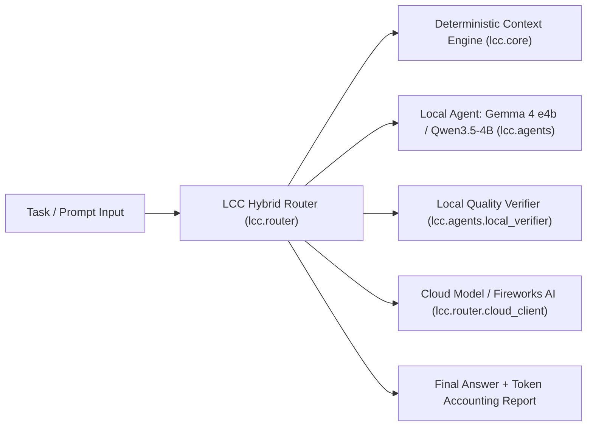
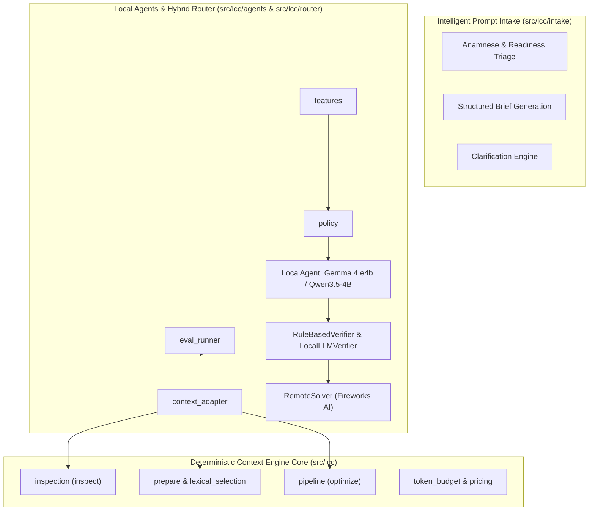
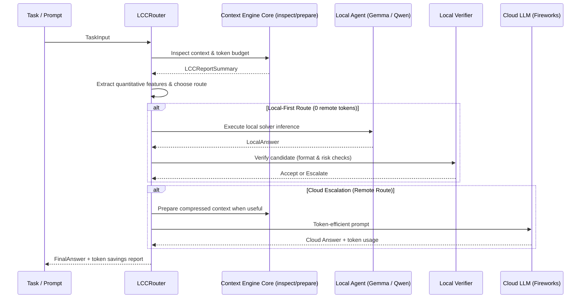
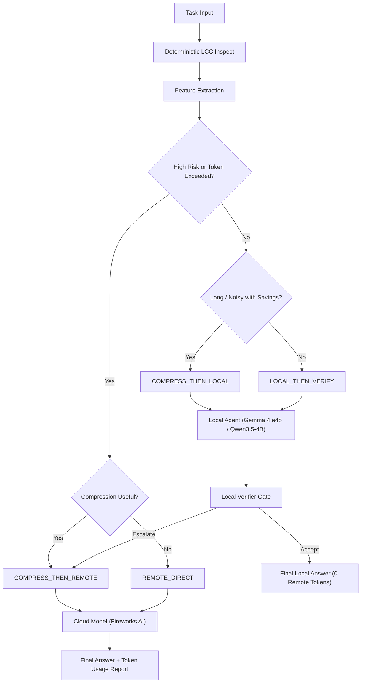
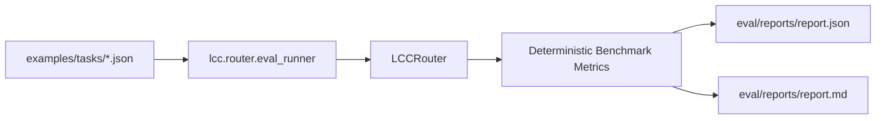

# LCC (Local Context Compiler) Architecture

`lcc` is a modular, local-first context optimization and intelligent agent execution toolkit. The system is organized around three permanent, decoupled pillars:

1. **Deterministic Context Engine Core** (`src/lcc/cleaning`, `src/lcc/token_budget`, `src/lcc/inspection`, `src/lcc/lexical_selection`, `src/lcc/pipeline`): 100% deterministic, zero network, zero LLMs inside core. Performs character/token counting, near-duplicate detection, and lexical chunk selection.
2. **Intelligent Prompt Intake & Triage** (`src/lcc/intake`): Structured anamnese, intent extraction, readiness classification, and clarifying question generation for human/voice inputs.
3. **Local Agents & Hybrid Router Subsystem** (`src/lcc/agents`, `src/lcc/router`): Executes local LLMs (Gemma 4 e4b, Qwen3.5-4B via Ollama, llama.cpp, vLLM, MLX) with 0 remote tokens, conservative verification gates, and policy-driven cloud escalation (Fireworks AI).

---

## System Context



---

## Container Diagram



---

## Routing Sequence



---

## Decision Flow



---

## Evaluation Pipeline



---

## LCC Baseline Boundary

The pre-existing LCC core follows the deterministic Phase 1.7 prepare boundary recorded
in [ADR 0010](adr/0010-deterministic-first-preparation-model-assistance.md). `lcc prepare`
uses deterministic inspect-first orchestration and question-aware lexical chunk selection.
Inside `src/lcc`, there is no semantic selection, embeddings, network access, local model call, or remote LLM call. The router and agent subsystem (`src/lcc/agents`, `src/lcc/router`) operate as an extensible orchestration layer outside that deterministic boundary.


---

## Programmatic Module & Ecosystem Integration Architecture

```mermaid
flowchart TD
  subgraph Library Module Exports
    PythonModule["src/lcc/compressor.py (LccCompressor)"]
    NodeModule["index.js / index.d.ts (LccCompressor)"]
    AgentModule["src/lcc/agents (LocalAgent)"]
    RouterModule["src/lcc/router (LCCRouter)"]
  end
  subgraph Ecosystem Integration (Intelligent Intake Pipeline)
    Ingestion["Raw User Input / Voice Transcript"] --> IntakeParse["lcc.intake Readiness Triage"]
    IntakeParse --> LccGuard["lcc Local Token Estimation & Guardrails"]
    LccGuard --> RouterDispatch["lcc.router Hybrid Routing & Execution"]
  end
  PythonModule --> Ecosystem Integration
  NodeModule --> Ecosystem Integration
  AgentModule --> Ecosystem Integration
  RouterModule --> Ecosystem Integration
```
