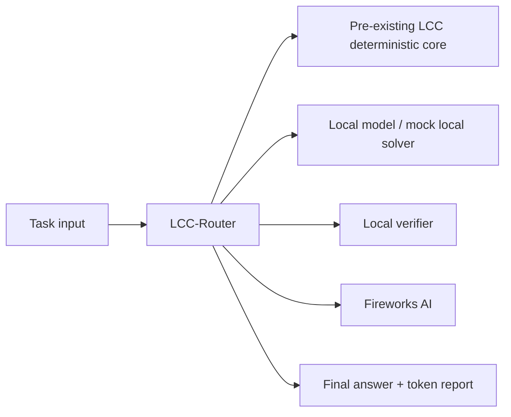
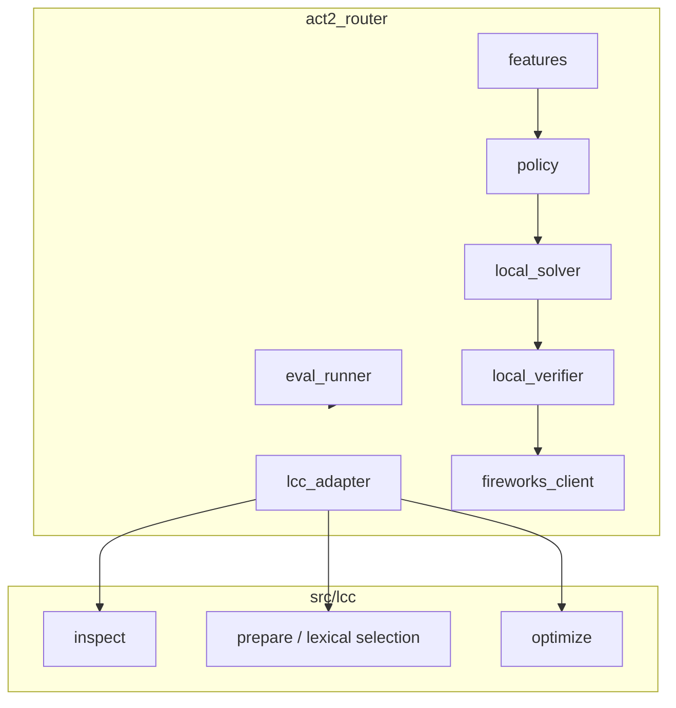
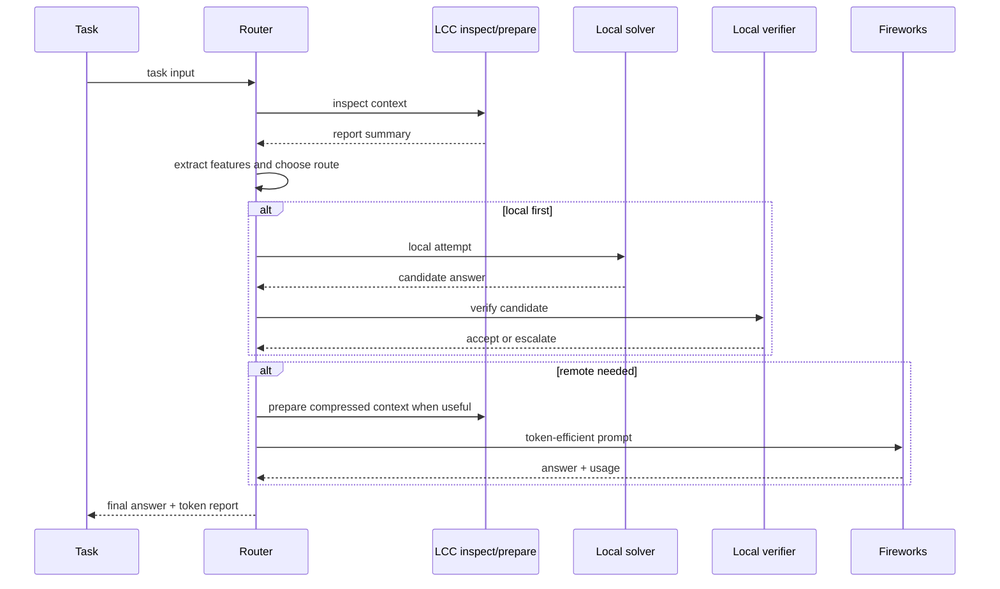
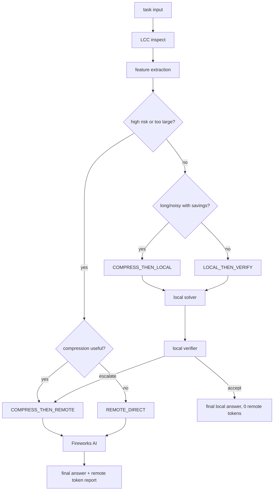
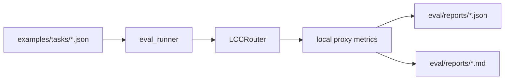

# LCC-Router Architecture

`src/lcc` remains deterministic. `act2_router` is the hackathon layer that decides whether to
answer locally, verify locally, compress context, or escalate to Fireworks AI.

## System Context



## Container Diagram



## Routing Sequence



## Decision Flow



## Evaluation Pipeline



Conceptual flow:

```text
task input
  -> LCC inspect
  -> feature extraction
  -> route decision
  -> local solver
  -> local verifier
  -> accept local OR escalate
  -> LCC compressed remote prompt
  -> Fireworks AI
  -> final formatter
  -> final answer + token report
```

## LCC Baseline Boundary

The pre-existing LCC core still follows the deterministic Phase 1.7 prepare boundary recorded
in [ADR 0010](adr/0010-deterministic-first-preparation-model-assistance.md). `lcc prepare`
uses deterministic inspect-first orchestration and question-aware lexical chunk selection.
Inside `src/lcc`, there is no semantic selection, embeddings, network access, local model
call, or remote LLM call. The router layer is outside that boundary.

## Programmatic Module & Ecosystem Integration Architecture

```mermaid
flowchart TD
  subgraph Library Module Exports
    PythonModule["src/lcc/compressor.py (LccCompressor)"]
    NodeModule["index.js / index.d.ts (LccCompressor)"]
  end
  subgraph Ecosystem Integration (agentic-intake)
    Ingestion["Raw User Input / Voice Transcript"] --> IntakeParse["agentic-intake Readiness Triage"]
    IntakeParse --> LccGuard["lcc Local Token Estimation & Guardrails"]
    LccGuard --> LLMDispatch["Optimized Payload / LLM Dispatch"]
  end
  PythonModule --> Ecosystem Integration
  NodeModule --> Ecosystem Integration
```

