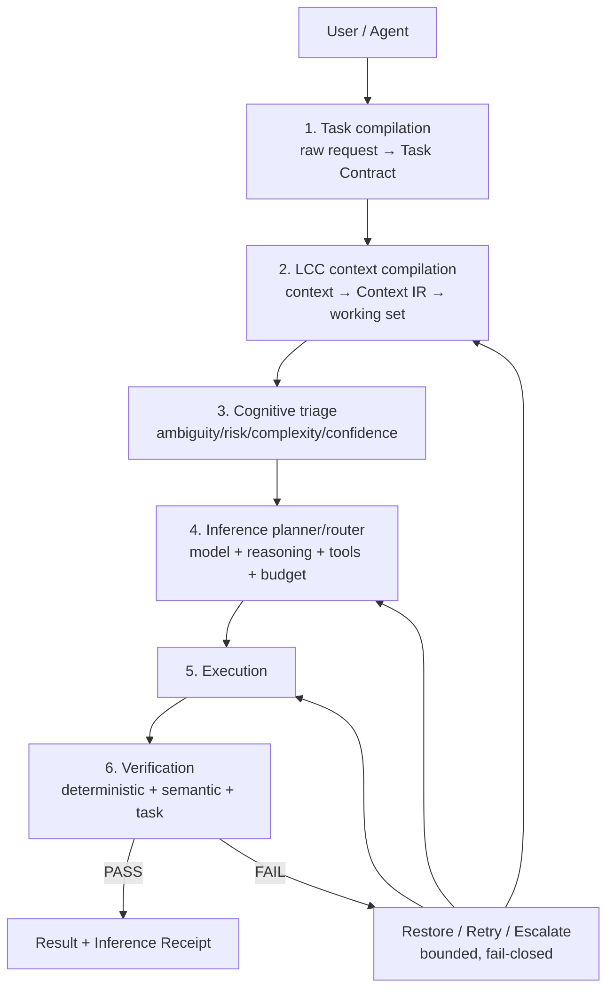
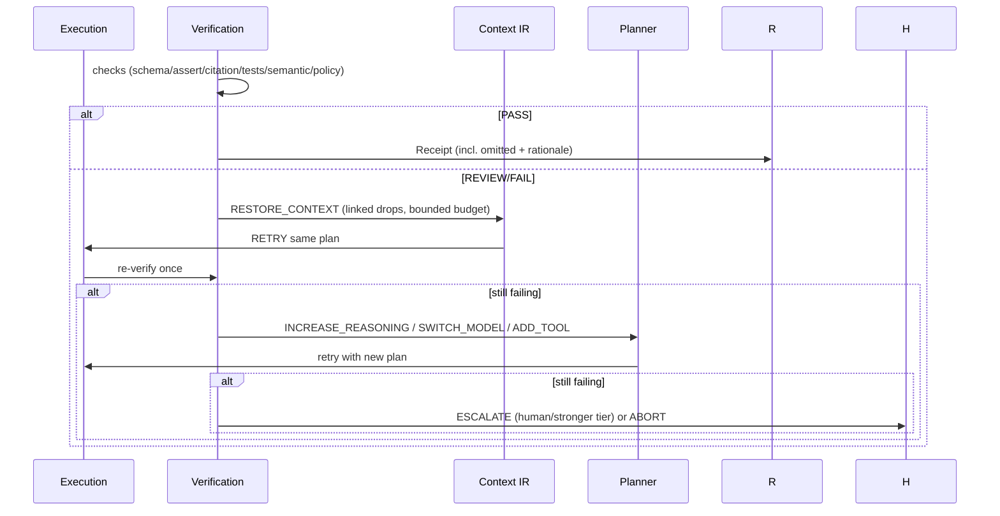

# MSI Target Architecture v0 (Sprint-0 baseline)

## Component + data flow

## Failure / restoration flow

Note: verifier never re-runs on its own output (LCC `verifier.py` precedent: single-shot, no loop). Retries bounded; every transition logs a decision event with reason.

## Repository boundaries

- **LCC**: context → Context IR → working set + sufficiency + restoration metadata. No provider routing, no model execution.
- **MSI spec** (new `minimum-sufficient-inference` repo, spec-only at first): Task Contract, Context IR, Inference Plan, Verification Result, Inference Receipt schemas + versioning. No LCC implementation duplication.
- **Triage engines**: pluggable behind `(decision, confidence, escalate_risk) → route`. Jev = one adapter (from triage-benchmark gate), alongside deterministic policy / small local model / rules.
- **Verification**: protocol extracted from AgentTrace (`checks.py`/`ci_gate.py`/citation_auditor shape), not a product dependency.
- **lookaorchestrator**: consumer/testbed only; traces flow out, specs never depend on it.
- **recallgraph-ai**: pattern reference only.
- **lcc-act2-router / agentic-prompt-intake**: no boundaries — archived or spec-only (see 04).
